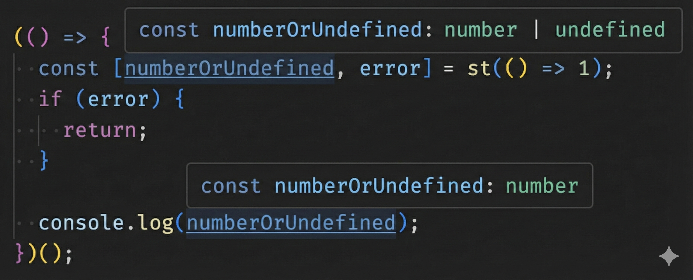

# safely-try

[](https://github.com/jeeyo/safely-try/actions/workflows/test.yml)
[](https://www.npmjs.com/package/safely-try)

`safelyTry()` is a type-safe elegant try-catch replacement for JavaScript / TypeScript inspired by [Go error handling](https://go.dev/blog/error-handling-and-go).

## Installation

```bash
npm i --save safely-try
```

## Usage

Instead of using ugly native try-catch like this

```typescript
let result;
try {
  result = somethingMightThrowException();
} catch(e) {
  handleTheError(e);
}
```

you can use `safelyTry` to do something like this

```typescript
import safelyTry from 'safely-try';

const { data: result, error } = safelyTry(somethingMightThrowException);
if (error) {
  handleTheError(error);
  return;
}
```

or you can use `safelyTryTuple` to do something like this

```typescript
import { safelyTryTuple as st } from 'safely-try';

const [result, error] = st(somethingMightThrowException);
if (error) {
  handleTheError(error);
  return;
}
```

## Screenshots

Type inference works with Language Server Protocol (LSP) in your favorite IDE



*Two screenshots were taken from Visual Studio Code and combined with Nano Banana Pro*
